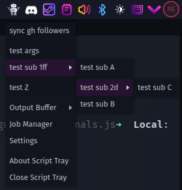
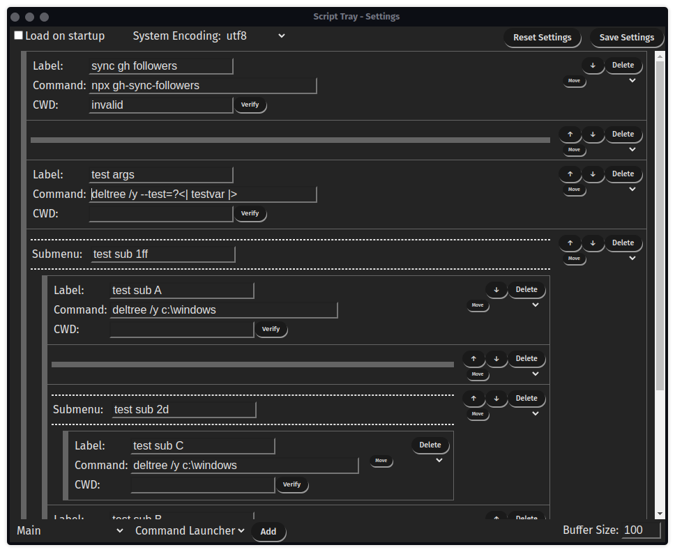
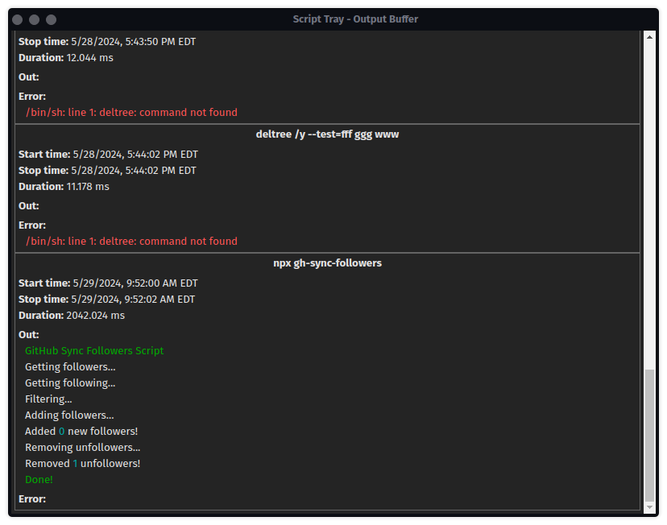
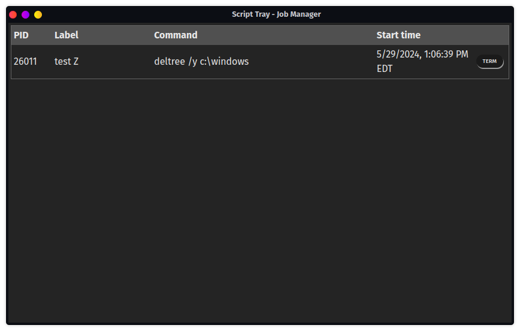

<table align="center">
<tr>
  <td>
    
  </td>
  <th>
    <h1>Script Tray</h1>
    Run commands from your system tray
  </th>
</tr>
</table>

__Script Tray__ is an utility that sits in your system tray and allows you to run preconfigured scripts or commands from a click of a button.  Save yourself some keystrokes and run all your common commands from here!

# Features

## Settings Menu

Fully configurable commands with submenus and separators for organization.  Also allows for variables to be used within commands.  These will be propted for durring script execution.  The format for these variables is:  `?<| example |>`

## Output Buffer

Viewable output buffer with ANSI styling!  Can also be saved to JSON or Log file *(.log or .txt)* from the tray menu.

## Job Manager

View running jobs and cancel running or hung scripts.

Robot icon made from <a href="http://www.onlinewebfonts.com">Web Fonts</a>
is licensed by <a href="https://creativecommons.org/licenses/by/4.0/">CC BY 4.0</a>

